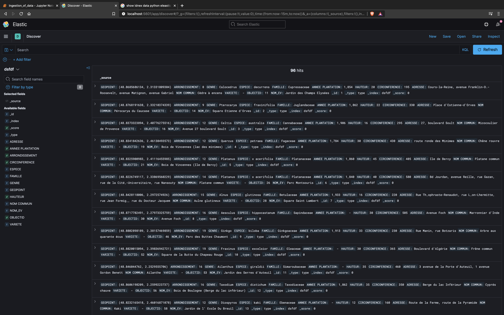
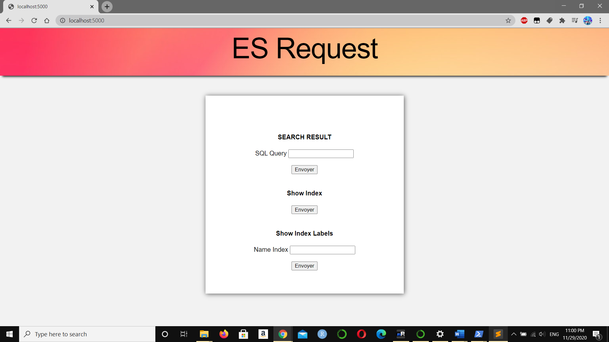
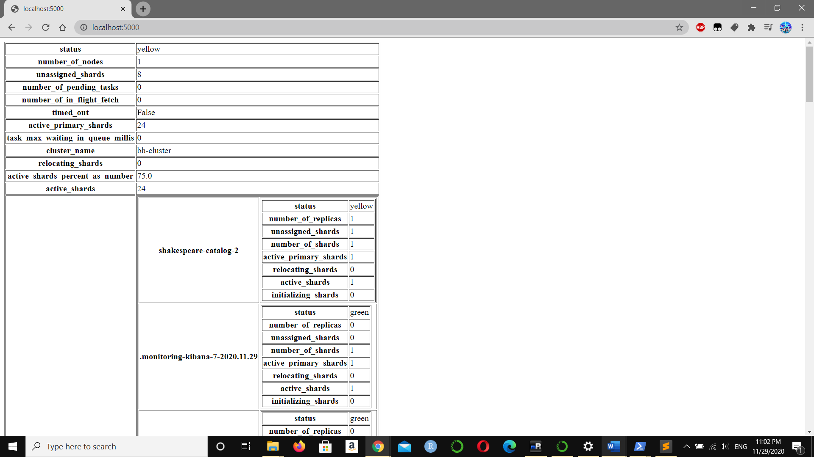
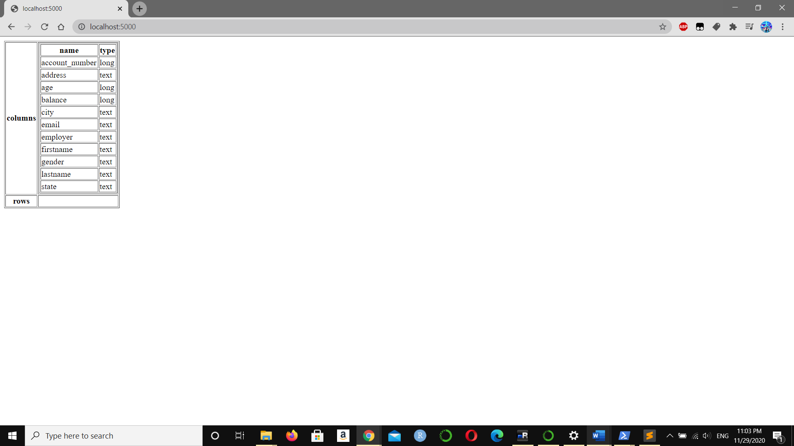
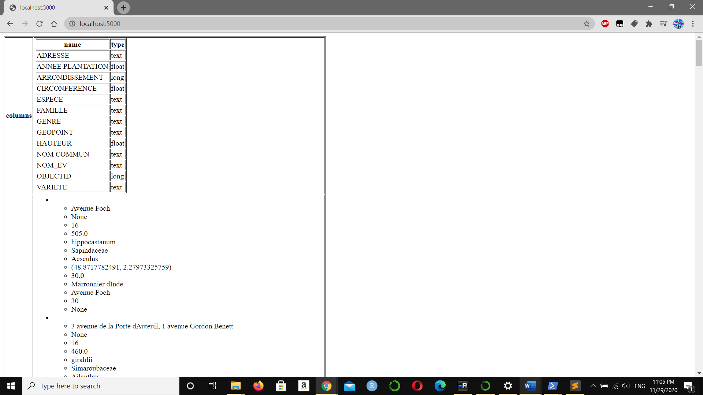

# Librairies
```python
> csv
> json
> pandas
> elasticsearch 
> flask
> requests
> json2html
```

# Installation example
ES must be on port 9200 & Kibana on port 5601

```bash
./elasticsearch
```
```bash
./bin/kibana
```
```bash
python Ingestion_of_data.py
Enter index name: tree
Enter file name with extension: trees.csv
```
=> Create the index pattern in "Stack Management"


# Ingestion of data
Launch the python file in the same directory as trees.csv. This will convert your file form csv to json and import these data to a new ES index. Don't forget to create the index pattern after in "Stack Management". If you have an issue entering your index and file name, please change directly the value in the python file (issue regarding powershell). 



# Queries

Launch the python file in the same directory as the folder templates. This will run the web application on localhost on port 5000 by default.








